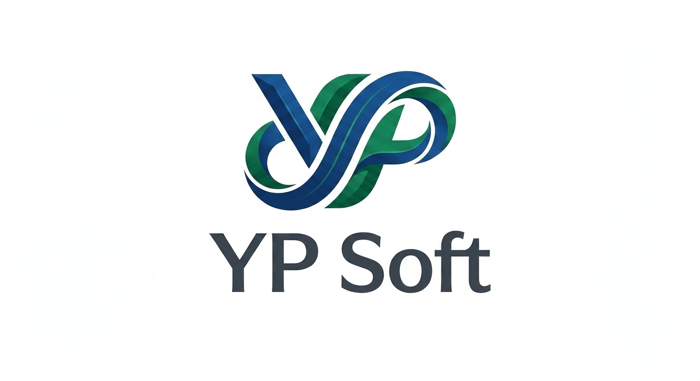
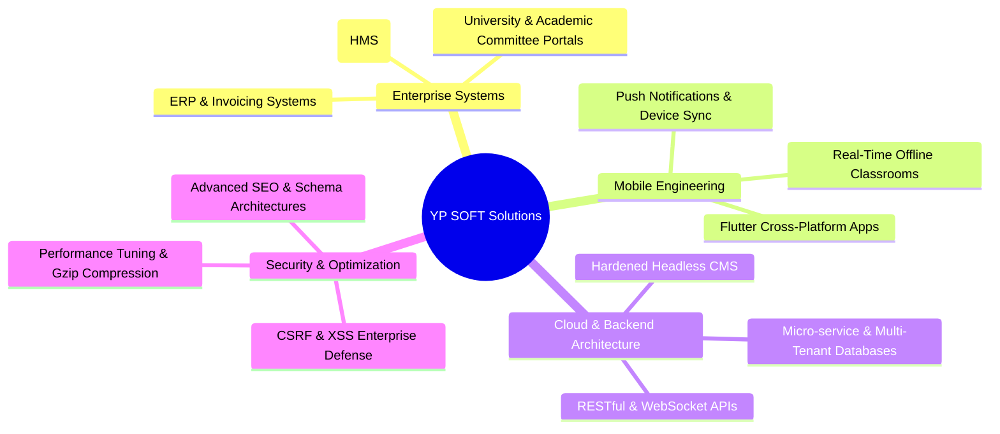

# YP SOFT - Corporate Portal & Digital Solutions Showcase

<p align="center">
  
</p>

<p align="center">
  <strong>Official Portfolio & Technology Showcase of YP SOFT Software Solutions</strong>
</p>

<p align="center">
  
  
  
  
  
</p>

---

## 📌 Notice
> [!IMPORTANT]
> **This public repository is the official company portfolio and capability showcase for YP SOFT.**
> The underlying source code, database architecture, and proprietary CMS engine are **closed-source and confidential**.
> 
> To request project proposals, commercial development, or technical consulting, please see the [Contact & Inquiries](#-contact--commercial-inquiries) section below.

---

## 🏢 About YP SOFT

**YP SOFT** is an agile software development agency and digital solutions provider. We specialize in engineering bespoke enterprise software, mission-critical healthcare systems, educational platforms, multi-tenant cloud architectures, and cross-platform mobile applications for businesses and institutions across the Middle East and worldwide.

---

## 🚀 Core Competencies & Service Offerings



---

## 🏆 Featured Project Portfolio

Our portfolio encompasses diverse production solutions delivered with high reliability:

| Project | Sector | Technology Highlights |
| :--- | :--- | :--- |
| **Al-Badr Hospital Management System (HMS)** | Healthcare & EHR | Multi-department clinical orchestration (Admin, Doctors, Lab, Admissions, Reception) with REST API mobile gateway. |
| **Zakir Smart Classroom Platform** | Offline EdTech | Zero-internet classroom server with SoftAP Wi-Fi, DNS Captive Portal, sub-second HLS screen streaming, and remote touch control. |
| **Academic Scientific Committee Platform** | Higher Education | 3-Tier multi-tenant university portal with integrated Multi-AI (Gemini, DeepSeek, ChatGPT) lecture summarization. |
| **YP SOFT Corporate Engine & CMS** | Corporate & Media | Ultra-fast responsive portal with custom dynamic CMS, real-time analytics, and search engine optimization. |

---

## 🛡 Proprietary CMS & Security Architecture

The YP SOFT corporate platform is powered by a proprietary in-house Content Management System built with enterprise-grade defensive practices:

- **Strict CSRF Token Guards:** Every state-altering administrative action requires cryptographically secure token validation (`bin2hex(random_bytes(32))`).
- **Defensive Input Sanitization:** Global XSS mitigation stripping harmful entities from all user-submitted form data.
- **Clickjacking & MIME Protection:** Enforces strict HTTP response headers:
  ```http
  X-Frame-Options: DENY
  X-Content-Type-Options: nosniff
  X-XSS-Protection: 1; mode=block
  ```
- **Prepared Data Binding:** 100% of database interactions utilize PDO prepared statements with native parameterized queries.
- **Dynamic Asset & Output Compression:** Native `ob_gzhandler` compression pipeline ensuring lightning-fast load times on both mobile and desktop devices.

---

## 👥 Engineering & Technical Leadership

- **Engineering Lead & Solution Architect:** Amged Alfadly
- **GitHub:** [@Amged-Alfadly](https://github.com/Amged-Alfadly)
- **Specialization:** Full-Stack Architecture, Educational Software, System Security & AI Engineering.

---

## 📬 Contact & Commercial Inquiries

Are you looking to build your next custom software, enterprise system, or mobile app?

- **GitHub Profile:** [@Amged-Alfadly](https://github.com/Amged-Alfadly)
- **Business Inquiries:** Open for contract software development, technical consultation, and custom enterprise deployments.
- **Request a Quote / Demo:** Contact via GitHub or WhatsApp to discuss your technical specifications.

---

## 📄 Intellectual Property Notice

```text
Copyright (c) 2024-2026 YP SOFT Software Solutions. All Rights Reserved.
All logos, branding, case studies, and proprietary system concepts are protected
under international copyright and intellectual property legislation.
```
